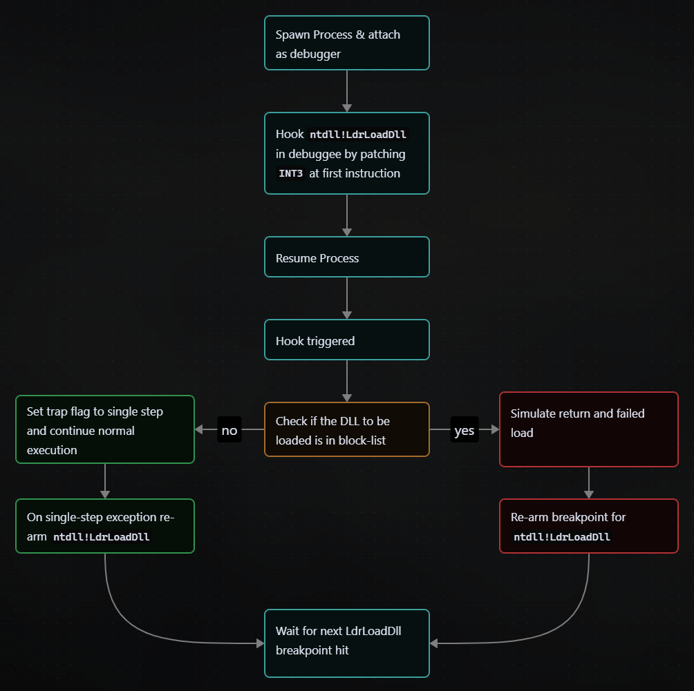
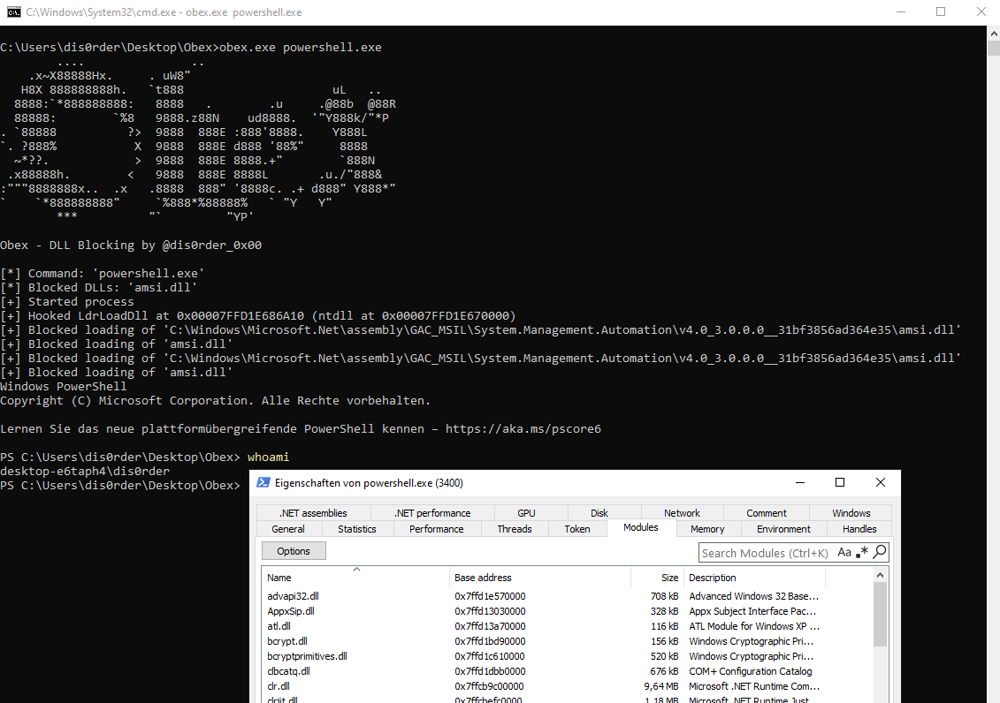

# Obex - DLL Blocking

**Obex** is a PoC tool/technique that can be used to prevent unwanted modules (e.g., EDR or monitoring libraries) from being loaded into a newly started process during process initialization or at runtime.

## Features
- Spawns any process with arguments under debug control.
- Blocks a configurable list of DLLs by name.
- Works both for startup DLLs and dynamically loaded DLLs (`LoadLibrary*`).
- Written in plain C with no external dependencies.

## Usage
```
obex.exe "<command with args>" [dll1.dll,dll2.dll,...]
```
- If no DLL list is provided, a default blocklist is used (at the time of writing just `amsi.dll`).
- DLL names are case-insensitive.

## How Does It Work?
Besides parsing cli arguments the PoC does the following (in a rough overview):


For deeper understanding check code (obviously) or contact me on discord or [twitter](https://x.com/dis0rder_0x00).
## Screenshot
The screenshot shows `obex` spawning `powershell.exe` with the default blocklist (only `amsi.dll`).
Additionally you can see the spawned process’s module list to verify that `amsi.dll` was not loaded.



